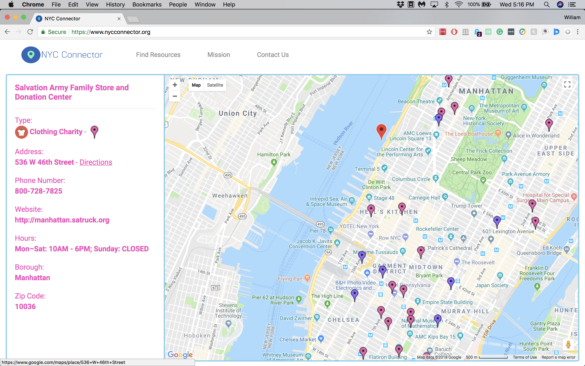

# NYC-Connector - [https://www.nycconnector.org](https://www.nycconnector.org)
### *Connecting Individuals and Resources!*
Built by **[Coding for Impact](https://www.codingforimpact.org)**, [NYC Connector](https://www.nycconnector.org) is a project which allows users to easily find and locate places near them where they can volunteer at, donate to, or find help at, such as soup kitchens, food pantries, SNAP centers, senior centers, food scrap drop-off sites, as well as clothing charities, homeless shelters, and medical centers. Enter an address or zip code and select the places you want to see, and resources nearby will be displayed on the map. Click on a pinpoint marker to view information about the resource. It's as easy as that!

**[Coding for Impact](https://www.codingforimpact.org)** is a student-led club at Hunter College High School, with the goal of developing software and web applications that positively impact the world.

